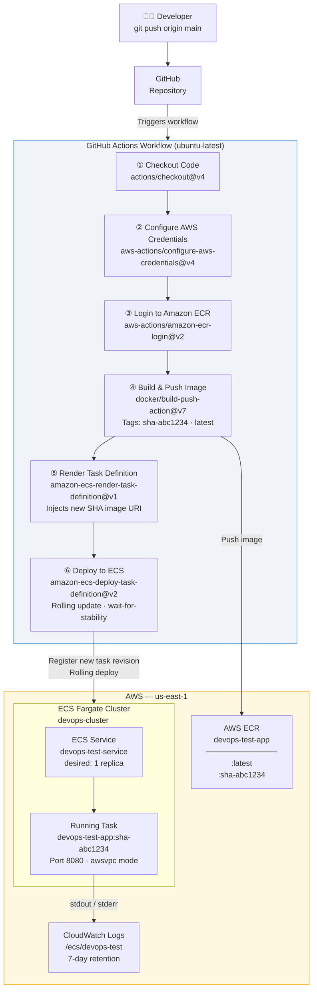

# CI/CD Pipeline (GitHub Actions)

## Overview

An automated CI/CD pipeline built with **GitHub Actions** that triggers on every push to `main`. The pipeline builds the Application Docker image, tags it with the Git commit SHA, pushes it to **AWS ECR**, and deploys the updated container to an **AWS ECS Fargate** service via a rolling update.

All AWS infrastructure (ECR, ECS cluster, service, IAM roles) is provisioned with **Terraform** in `task_3/terraform/`. The GitHub Actions workflow only manages the dynamic deployment cycle.

**Marks:** 20 / 100  
**Tools:** GitHub Actions, Terraform ≥ 1.15.0, AWS ECR, AWS ECS Fargate

---

## Architecture Diagram — Pipeline Flow



---

## File Structure

```
task_3/
├── terraform/
│   ├── main.tf           # Provider + data sources (discovers Infrastructure VPC/subnets by tag)
│   ├── variables.tf      # Input variables
│   ├── terraform.tfvars  # Variable values (gitignored)
│   ├── ecr.tf            # ECR repository + lifecycle policy (keep last 10 images)
│   ├── iam.tf            # ECS task execution IAM role
│   ├── ecs.tf            # ECS cluster, task definition, service, security group
│   └── outputs.tf        # ECR URL, cluster name, service name, container name
.github/
└── workflows/
    └── docker-build-push.yml   # The full CI/CD pipeline
```

---

## Prerequisites

| Requirement | Detail |
|---|---|
| Infrastructure deployed | CI/CD Terraform discovers the VPC + subnets from Infrastructure by name tag |
| AWS CLI configured | `aws sts get-caller-identity` must return your account |
| GitHub Secrets set | `AWS_ACCESS_KEY_ID` and `AWS_SECRET_ACCESS_KEY` in repo Settings → Secrets |

### IAM permissions required for the CI/CD user

- `AmazonEC2ContainerRegistryFullAccess`
- `AmazonECS_FullAccess`

---

## Setup & Deployment

### Step 1 — Provision AWS infrastructure with Terraform

```bash
cd task_3/terraform/

terraform init
terraform plan
terraform apply
```

**Resources created:**
- ECR repository (`devops-test-app`) with image scanning + 10-image lifecycle policy
- ECS Fargate cluster (`devops-cluster`) with Container Insights enabled
- ECS task definition (initial revision, `256 CPU / 512 MB`)
- ECS service (`devops-test-service`, 1 replica, `awsvpc` network mode)
- Security group allowing port 8080
- ECS task execution IAM role
- CloudWatch log group (`/ecs/devops-test`, 7-day retention)

**After apply — note these outputs for the workflow:**
```
ecr_repository_url = "593793056080.dkr.ecr.us-east-1.amazonaws.com/devops-test-app"
ecs_cluster_name   = "devops-cluster"
ecs_service_name   = "devops-test-service"
container_name     = "devops-test-app"
```

### Step 2 — Add GitHub Secrets

In your repo: **Settings → Secrets and variables → Actions → New repository secret**

| Secret | Value |
|---|---|
| `AWS_ACCESS_KEY_ID` | IAM user Access Key ID |
| `AWS_SECRET_ACCESS_KEY` | IAM user Secret Access Key |

### Step 3 — Push to trigger the pipeline

```bash
git add .
git commit -m "feat: add CI/CD pipeline"
git push origin main
```

### Step 4 — Verify

```bash
# Check ECR image tags
aws ecr describe-images --repository-name devops-test-app --region us-east-1 --output table

# Check ECS service health
aws ecs describe-services \
  --cluster devops-cluster \
  --services devops-test-service \
  --region us-east-1 \
  --query "services[0].{Status:status,Running:runningCount,Desired:desiredCount}"

# Get running task public IP
TASK_ARN=$(aws ecs list-tasks --cluster devops-cluster --service-name devops-test-service \
  --region us-east-1 --query "taskArns[0]" --output text)
ENI_ID=$(aws ecs describe-tasks --cluster devops-cluster --tasks $TASK_ARN \
  --region us-east-1 \
  --query "tasks[0].attachments[0].details[?name=='networkInterfaceId'].value" --output text)
PUBLIC_IP=$(aws ec2 describe-network-interfaces --network-interface-ids $ENI_ID \
  --query "NetworkInterfaces[0].Association.PublicIp" --output text)
curl http://$PUBLIC_IP:8080
```

### Step 5 — Destroy

```bash
# Scale to 0 first (required before Terraform can delete the service)
aws ecs update-service --cluster devops-cluster \
  --service devops-test-service --desired-count 0 --region us-east-1

sleep 30

# Force-delete ECR repo (images must be removed first)
aws ecr delete-repository --repository-name devops-test-app --force --region us-east-1

cd task_3/terraform/
terraform destroy
```

---

## Key Design Decisions

### Terraform manages infrastructure, GitHub Actions manages deployments
Terraform creates the long-lived infrastructure (ECR, ECS cluster, service). GitHub Actions manages the dynamic part (which image revision is running). The ECS service has `ignore_changes = [task_definition]` so Terraform never rolls back a deployment made by the CI/CD pipeline.

### Immutable image tags (`sha-<commit-hash>`)
Every image is tagged with `sha-<full-git-sha>`. This makes every image uniquely traceable to its source commit. Rollbacks are trivial — re-deploy an old SHA tag. The `:latest` tag is also applied as a convenience reference.

### `wait-for-service-stability: true`
The deploy step polls ECS until the new task passes health checks and the old task drains. Without this, the pipeline would report success even if the container crashes on boot — a classic false positive that wastes debugging time.

### BuildKit layer caching (`type=gha`)
Docker layer cache is stored in GitHub Actions cache storage. If only `index.js` changes between commits, the `npm ci` layer is served from cache, reducing pipeline duration from ~3 minutes to ~30 seconds.
